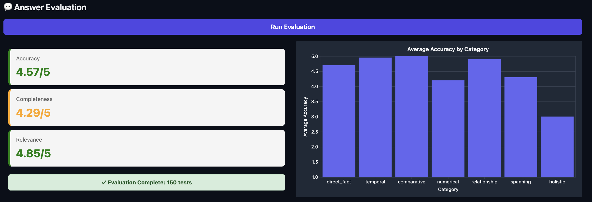

# RAG Evaluator
 
A evaluation framework for RAG pipelines that measures both **retrieval quality** and **answer accuracy** — because if you're building RAG without evals, you're mostly guessing.
 

 

 
For the full breakdown of the methodology, metrics, and lessons learned, read the blog post:
 
**📖 [RAG Is the Easy Part. Evals Are the Real Project.](https://medium.com/@ismayilzadeemil0707/rag-is-the-easy-part-evals-are-the-real-project-11b705877f2d)**
